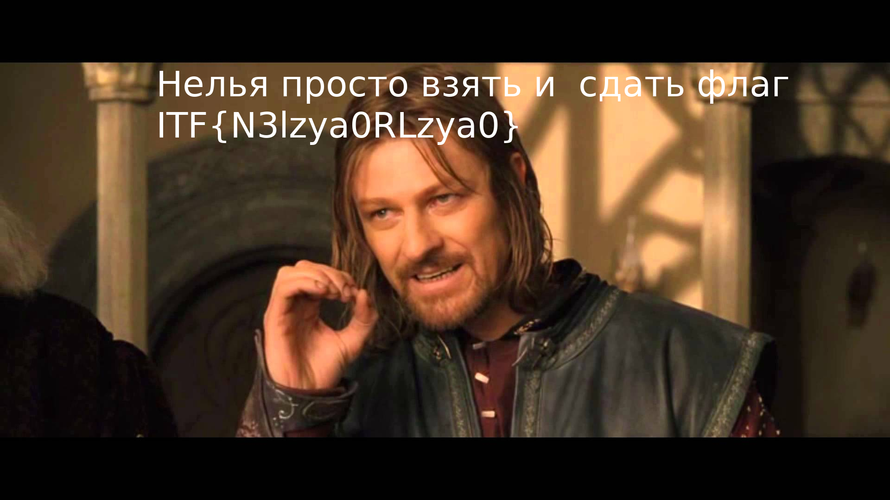

#  Нельзя взять и...  


**Description:** Нельзя просто взять и декриптануть что-то! Или можно?

**Author:** tiso a.k.a. tisOOv

**Category:** Crypto

**Score:** 100

**Note:** Зашифрованный файл лежит в папке source. Если не хотите спойлеров, то открывайте только файл crypted.jpg

**Write-up:**

Первым делом попробуем открыть файл любым приложением для просмотра изображений. Ииии у нас ничего не получится, так как изображения якобы содержит ошибки. Хорошо... Попробуем открыть изображение с помощью бинарного просмотрщика (например, при помощи команды hexdump):

```
hexdump -C source/crypted.jpg| less

00000000  93 b7 93 8c 6f 7c 26 29  25 2a 6f 6d 6d 6e 6c 24  |....o|&)%*ommnl$|
00000010  6f 24 6c 6f 93 b7 6f 2f  6c 6e 6d 6d 6e 6d 6d 6e  |o$lo..o/lnmmnmmn|
00000020  6d 6d 6e 6d 6d 6e 6d 6d  6e 6d 6d 6e 6d 6d 6e 6d  |mmnmmnmmnmmnmmnm|
00000030  6d 6e 6d 6d 6e 6d 6d 6e  6d 6d 6e 6d 6d 6e 6d 6d  |mnmmnmmnmmnmmnmm|
00000040  6e 6d 6d 6e 6d 6d 6e 6d  6d 6e 6d 6d 6e 6d 6d 6e  |nmmnmmnmmnmmnmmn|
00000050  6d 6d 6e 6d 6d 6e 6d 6d  6e 93 b7 6f 2f 6d 6e 6d  |mmnmmnmmn..o/mnm|
00000060  6d 6e 6d 6d 6e 6d 6d 6e  6d 6d 6e 6d 6d 6e 6d 6d  |mnmmnmmnmmnmmnmm|
00000070  6e 6d 6d 6e 6d 6d 6e 6d  6d 6e 6d 6d 6e 6d 6d 6e  |nmmnmmnmmnmmnmmn|
00000080  6d 6d 6e 6d 6d 6e 6d 6d  6e 6d 6d 6e 6d 6d 6e 6d  |mmnmmnmmnmmnmmnm|
00000090  6d 6e 6d 6d 6e 6d 6d 6e  6d 6d 6e 6d 6d 6e 93 ae  |mnmmnmmnmmnmmn..|
...
```

Хмм, выглядит файл странно. Но может быть так и должно быть? Давайте погуглим, как выглядит формат jpg-файла. Согласно информации [с Википедии](https://ru.wikipedia.org/wiki/JPEG#%D0%A1%D0%B8%D0%BD%D1%82%D0%B0%D0%BA%D1%81%D0%B8%D1%81_%D0%B8_%D1%81%D1%82%D1%80%D1%83%D0%BA%D1%82%D1%83%D1%80%D0%B0) заголовок картинки точно должен иметь байты 0xFFD8, то есть байты 0xFF и 0xD8 должны идти первыми, но их там нет. О чём это может говорить? Это может говорить о том, что изображение скорее всего зашифровано (удивительно да, что в задании на криптографию файл зашифрован?:))

Кроме того в файле мы видим много раз повторяющееся слово lol. Из этого можно сделать вывод, ну или попробовать сделать вывод, что изображение скорее всего было зашифровано при помощи метода XOR с использованием ключа lol. А значения lol получились при XOR'е нулевых байтов с ключом. Давайте проверим это, декриптовав первые 2 байта, сделаем для начала это руками:

```
ord('l') = 0x6c
ord('o') = 0x6f

0x93 ^ 0x6c = 0xFF
0xB7 ^ 0x6f = 0xD8
```

Как мы видим, заголовок совпадает с заголовком jpeg-изображения. Ну значит мы на верном пути, осталось только применить XOR для ключа lol ко всему изображению. Конечно, это можно сделать руками и закончить делать это к следующему Новому году, но лучше всё же написать скрипт:

```python

key = "lol"

with open('decrypted.jpg', 'wb') as fout:
    with open('crypted.jpg', 'rb') as fin:
        idx = 0

        byte = fin.read(1)
        while byte:
            v = int.from_bytes(byte, byteorder='big')
            b = v ^ ord(key[idx])
            idx = (idx + 1) % 3
            fout.write(bytes([b]))
            byte = fin.read(1)

```

Как мы видим, скрипт получился довольно простой. А в результате мы получим такое изображение:



Флаг - ```ITF{N3lzyaORLzya0}```