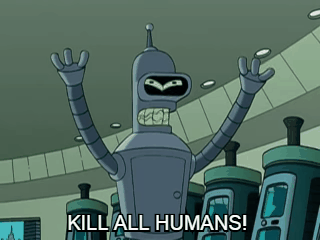

# Bender >_< 


**Description:** Нам кажется, что Бендер что-то прячет в своей комнате. Узнай что! Но будь осторожен, узнать будет не так просто...

**Author:** tiso a.k.a. tisOOv

**Category:** Web

**Score:** 50

**Note:** Для локального запуска запуска сервиса необходимо перейти в директорию source и выполнить указания из README.md

**Write-up:**

Ну первым делом, как обычно, открываем страницу задания и видим страничку с различными персонажами Futurama. Направляемся в гости к Бендеру!

На странице Бендера мы видим... Эм.. Ничего полезного:



Давайте попробуем взглянуть на исходный код страницы:

```html
<html>
<head>
    <title>Bender</title>
    <meta charset="utf-8">
    <meta name="viewport" content="width=device-width, initial-scale=1, shrink-to-fit=no">
    <link rel="stylesheet" href="https://maxcdn.bootstrapcdn.com/bootstrap/4.0.0-beta.2/css/bootstrap.min.css" integrity="sha384-PsH8R72JQ3SOdhVi3uxftmaW6Vc51MKb0q5P2rRUpPvrszuE4W1povHYgTpBfshb" crossorigin="anonymous">
</head>
<body>
    <div class="container">
    
                    
                </div>
</body>
</html>
```

В исходном коде мы тоже не видим ничего полезного, разве что видим, что используется bootstrap, который на самом деле практически не используется...

Хмм... Тут мы можем впасть в депрессию, бросить решать задание, задуматься о том, чтобы перевестись учиться на эконом, но не стоит быть столь кардинальным. При анализе сайтов исследователь должен помнить про такой файл, как robots.txt. Подробнее о нём можно почитать [на Википедии](https://ru.wikipedia.org/wiki/%D0%A1%D1%82%D0%B0%D0%BD%D0%B4%D0%B0%D1%80%D1%82_%D0%B8%D1%81%D0%BA%D0%BB%D1%8E%D1%87%D0%B5%D0%BD%D0%B8%D0%B9_%D0%B4%D0%BB%D1%8F_%D1%80%D0%BE%D0%B1%D0%BE%D1%82%D0%BE%D0%B2). 

На самом деле для исследователя файл robots.txt является самым настоящим кладом, потому что он может раскрывать некоторую информацию об устройстве исследуемого ресурса (в исследованиях защищенности любая дополнительная информация может оказаться полезной). Давайте проверим, есть ли такой файл на нашем ресурсе... Ииии такой файл есть. Его содержимое:

```
User-agent: *
Disallow: /

User-agent: Bender
Allow: /bender.php

```

Из файла мы видим, что всем user-agent'ам на сайт доступ запрещен (во всяком случае честные-добрые поисковые роботы будут учитывать этот файл при индексации), но для user-agent'а Bender есть исключение, он может получать доступ к файлу bender.php (это как раз тот файл, в котором Бендер говорил: KILL ALL HUMANS). Давайте попробуем подменить user-agent (вы можете это сделать, поставив расширение по смене user-agent'ов в браузер) и зайти на ту страницу, в итоге мы увидим флаг:

```
ITF{2_be333eee3eee333e333eee333ee3ee3e3e3e3ee3r}
```

Это было просто, не так ли? :)
